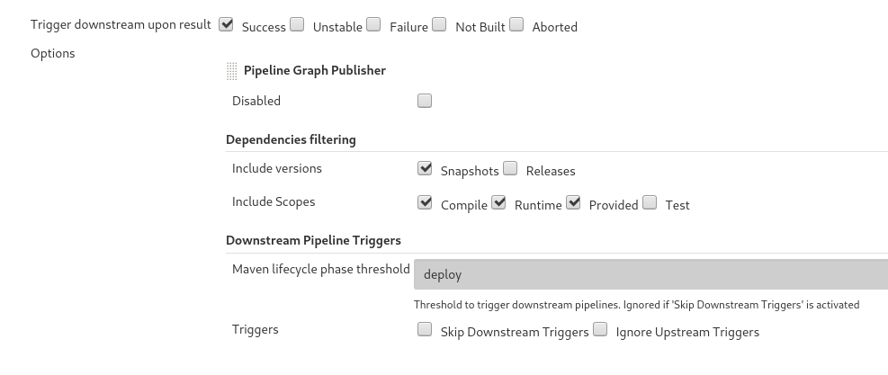

# About

This is an implementation of a Jenkins build pipeline which uses the Jenkins Kubernetes Plug-In to create dynamic build slaves.

> :warning: Always use a tagged version for your produktive CI builds. Master branch may receive breaking changes at any time!

## Features

* To be used with multibranch-pipeline jobs
* Easy to use

* maven build
   * Deploy maven artifacts
   * Automatically add branchname to maven snapshot version
   * Configure which maven settings.xml to use (provided by jenkins)
   * perform maven releases "the pipeline way"
       * On demand, a job tags a release and increases the maven version number
       * Jenkins picks up the tag and builds the release it using the same pipeline that is used for non-release builds
       * The maven release plug-in is only be used for tagging and versioning, so all pipeline steps required for release are performed (not only the maven part)

* node build
    * Run npm / yarn commands

* docker build
   * determine docker tag from git branch/tag
   * Configure which docker setting to use

* kubernetes deployments
    * Run kubectl / helm3 commands
    * Configure which maven kubeconfig to use (provided by jenkins)

* Build environment
  * jenkins/jnlp-slave:alpine (until 3.27-2-alpine or higher is released which contains https://github.com/jenkinsci/docker-jnlp-slave/pull/80)
  * docker:stable-dind
  * evermind/jenkins-maven:3-jdk-8-slim (Maven 3.x, OpenJDK 8.x)
      * This is basically the official image but running with the same user id as jenkins slave does which is important to avoid lots of unexpected behaviour (e.g. non-working ssh client due to file owner mismatch)
  * evermind/jenkins-maven:3-jdk-11-slim (if javaVersion is set to 11)
  * library/node:XX-slim where XX depends on "nodeVersion" and defaults to 13

* Build notifications via RocketChat


# Usage

## Jenkins setup

### Pipeline script settings

* Go to "Manage Jenkins" -> "Configure System" -> Subsection "Global Pipeline Libraries"
* Add a new Library
    * Name: JenkinsPipeline
    * Retrieval method: Modern SCM
    * Git Project Repository: (Github URL of this repository - use HTTPS for anonymous access)
    * Behaviours: Discover branches, Discover tags

### Kubernetes settings

* When installing Jenkins from HELM chart (https://github.com/helm/charts/tree/master/stable/jenkins), Kubernetes slaves are already set up by default
* Otherwise go to "Manage Jenkins" -> "Configure System" -> Subsection "Cloud" and Add a cloud of type "kubernetes"
* The pipeline expects the cloud to be named "kubernetes". This will be configurable in a later version.

### Maven settings

* Go to "Credentials" and create username/password credentials for your maven repository
* Go to "Manage Jenkins" -> "Managed files" and create a new "Maven settings.xml"
* Add your maven settings.xml. Use a speaking ID, e.g. my-maven-settings which can later be referenced in the pipeline
* Don't put credentials into the settings.xml, add it via the "credentials" feature of Jenkins
* The following example configures maven with
    * A custom maven repository that mirrors "central" - maven will try to load everything from there by default (allowing the pom.xml contains additional repos)
    * Using the custom repository to load snapshots and releases of artifacts
    * Using the custom repository to load snapshots and releases of maven plug-ins
    * Setting different paths in the the custom repository to be used for deployment of snapshot and release artifacts (no need to specify this in your project POMs)
    * Ensure that credentials with ServerId "nexus" are added that have read/write access to that repository
    * It's also possible to have different users for read and deploy. To do so, replace the "nexus::" part in altReleaseDeploymentRepository and/or altSnapshotDeploymentRepository with a different name and add credentials with ServerId matching this name.

```
<?xml version="1.0" encoding="UTF-8"?>


<settings xmlns="http://maven.apache.org/SETTINGS/1.0.0" 
          xmlns:xsi="http://www.w3.org/2001/XMLSchema-instance" 
          xsi:schemaLocation="http://maven.apache.org/SETTINGS/1.0.0 http://maven.apache.org/xsd/settings-1.0.0.xsd">


  <interactiveMode>false</interactiveMode>
  <mirrors>
    <mirror>
      <id>nexus</id>
      <mirrorOf>central</mirrorOf>
      <url>https://nexus.mycompany.com/nexus/content/groups/public</url>
    </mirror>
  </mirrors>
  <profiles>
    <profile>
      <id>nexus</id>
      <repositories>
        <repository>
          <id>central</id>
          <url>http://central</url>
          <releases><enabled>true</enabled></releases>
          <snapshots><enabled>true</enabled></snapshots>
        </repository>
      </repositories>
      <pluginRepositories>
        <pluginRepository>
          <id>central</id>
          <url>http://central</url>
          <releases><enabled>true</enabled></releases>
          <snapshots><enabled>true</enabled></snapshots>
         </pluginRepository>
      </pluginRepositories>
      <properties>
        <altReleaseDeploymentRepository>nexus::default::https://nexus.mycompany.com/nexus/content/repositories/releases</altReleaseDeploymentRepository>
        <altSnapshotDeploymentRepository>nexus::default::https://nexus.mycompany.com/nexus/content/repositories/snapshots</altSnapshotDeploymentRepository>
      </properties>
    </profile>
  </profiles>
  <activeProfiles>
    <activeProfile>nexus</activeProfile>
  </activeProfiles>

</settings>
```

### Docker settings

* If you use a private docker registry that requires authentification, go to "Credentials" and add one of type "username/password"
* Use a speaking ID, e.g. my-docker-credentials which can later be referenced in the pipeline

### Git Settings

* To be able to commit tags during maven releases, you need to setup email and name for git
* Go to "Manage Jenkins" -> "Configure System" -> Subsection "Git plugin"
* Set "Global Config user.name Value" and "Global Config user.email Value"

### Kubeconfig settings

* To execute helm3 or kubectl commands agains a remote k8s cluster (e.g. to trigger a deployment), a kubeconfig is required
* Go to "Manage Jenkins" -> "Managed files" and create a new "Custom file"
* Add your kubeconfig file. Use a speaking ID, e.g. my-kubeconfig which can later be referenced in the pipeline

## Project's Jenkinsfile

To use the pipeline in a maven (or other) project, create a file Jenkinsfile.groovy in the root of your project's git repository. It has the following syntax:

```
@Library("JenkinsPipeline@v1.5") _

JenkinsPipeline {
    config {
        mavenSettings("my-maven-settings")
        dockerRegistry("registry.mydomain.com","my-docker-credentials")
        kubeconfig("my-kubeconfig")
        notifyRocketChat("#my-dev-channel")
    }
    maven {
        dir("backend")
        javaVersion(8)
        before {}
        beforeRelease {}
        deploy(true)
        skipTests(false)
        enableReleases("master","other-branch")
        appendBranchToVersion(true,"master","other-branch")
        options("-Dmyprop=${vars.GIT_BRANCH_OR_TAG_NAME}")
        after {}
    }
    node {
        dir("frontend")
        nodeVersion(13)
        before {
            sh "yarn install && yarn build"
            sh "chown 1000.1000 build -R"
        }
    }
    docker {
        dir("docker")
        before {}
        imageName("${vars.MAVEN_ARTIFACT}")
        tag("${vars.MAVEN_VERSION}")
        after {}
    }
    docker "docker2", {
        dir("docker")
        before {}
        imageName("${vars.MAVEN_ARTIFACT}")
        tag("${vars.MAVEN_VERSION}")
        after {}
    }
    k8s {
        before {
            sh """
              kubectl --namespace myapp patch deployment myapp --patch '{ "spec":{"template":{"metadata":{"annotations":{"redeploy-enforced-by":"${JOB_NAME}-${BUILD_NUMBER}"}}}}}'
              """
        }
    }

}
```

* The first line imports this pipeline script library. The part after the @ references a tag or branch. For build stability, you should use a release-tag in your projects
* The JenkinsPipeline block calls the pipeline script
* SCM checkout is always done implicitly
    * This step adds GIT_BRANCH_OR_TAG_NAME to the "vars" which can be referenced by other sections
* The config section configures some basics:
    * mavenSettings() references the ID of the Maven settings.xml described above
    * dockerRegistry() tells docker to use this registry URL (optionally with a credentials ID)
        * if set, all steps will be run with this docker registry configured (e.g. maven tasks that pull docker images will use it)
    * kubeconfig() references the ID of the kubeconfig described above
    * notifyRocketChat() enables rocket chat build notifications. It takes a channel as parameter. The RocketChat Notifier Plug-In must be installed and configured!
* If a maven section is present, a maven build will be done
    * if deploy is set to false (default) "mvn verify" is executed. If set to true, "mvn deploy" is executed
    * if skipTests is set to true, maven tests are skipped
    * The maven section adds MAVEN_GROUP, MAVEN_ARTIFACT and MAVEN_VERSION to the "vars" which can be referenced by other sections
    * If dir is set, the maven command is executed in the given directory
    * With enableReleases it is possible to enable maven releases on specific branches
        * enableReleases() without branches enables it for "master"
        * When a build is performed on this branch, parameters are added to the job to perform a maven release and to set the next version
        * When the "release" parameter is enabled, the job will use maven to build/verify the artifact, tag a release and set the new version
        * The tag will be release-1.2.3 (where 1.2.3 is the maven release version)
        * The release itself will be build by a new jenkins job created from the new tag
    * with options(), additional command line options can be passed to maven
    * if appendBranchToVersion is set to true, the branch name will be added to maven before deploying to nexus. This allows to have snapshot of branch builds. Optionally a list of branches that will not be added to the version can be specified (default is to append all branches except "master")
    * locale setting for java processing is 'user.language=de, user.region=DE' by default
    * javaVersion() sets the java version to use for this maven build. Currently 8 and 11 are supported. Default is 8
    * beforeRelease can contain jenkins pipeline code that is executed before a maven release is performed
* If a docker section is present, a docker build+push will be performed
    * imageName must be set
    * tag may be set. If not set, the current git branch or tag will be used.
    * If dir is set, the docker build command is executed in the given directory
    * Multiple docker sections are allowed, so it's possible to build more than one docker image (using the dir option)
* All sections (except config) allow a before{} and after{} block that will be executed before/after the actual block execution (e.g. before/after maven build)
    * These blocks can contain any jenkins pipeline command
    * On maven, before/after blocks are ommitted when preparing a release
* If a node section is pressent, a node container (containing tools like npm and yarn) is launched
    * the before/after blocks are executed in the node container and can contain arbitrary commands like "npm install"
    * currently, the container runs on a different user-id than the other containers, so run a "chown 1000.1000" as last command to allow the other containers to access the build results
    * nodeVersion() sets the node version to use for this build. Default is 13
* If a k8s secion is pressent, a container with kubernetes tools (helm3, kubectl) is launched
    * the before/after blocks are executed in the k8s container and can contain arbitrary commands like "kubectl patch"
    * if a kubeconfig is defined in the config section, it is used within tha container
* Each step can be repeated multiple times. It is possible to set the name for each step, e.g. `docker "my-step-name", { ...` - see above for an example.

## Run arbitrary commands in docker containers

Pipeline steps support shell commands within before-block. See example:

```groovy
        before {
          sh '''
            sudo apt-get update
            sudo apt-get install -y {package dependencies}
          '''
        }
```

## Run additional docker containers

Starting with version v1.2, it's possible to launch additional containers and optionally run commands in it. This can be used to launch sidecar containers like databases.

The custom step container has the following parameters:
* container: The name container to run on. Additional arguments are:
    * image: image to launch. If ommitted, an a container with the given name must already exist.
    * tmpfs: Optional path where to mount a tempfs filesystem (usefull for faster startup of databases)
    * env: a map of additional env variables passed to the container
    * alwaysPullImage (default false): if true, the image will always be pulled, otherwise only if not present
* run: an optional code block to run


### Example to run mysql as additional container

```groovy
JenkinsPipeline {
    custom "Start and wait for MySQL", {
        container("mysql",image:"mariadb:10.5",tmpfs:"/var/lib/mysql",env:[MYSQL_ALLOW_EMPTY_PASSWORD:"1",MYSQL_DATABASE:"local_test"])
        run {
            sh('''
                # wait until MySQL is really available
                maxcounter=45
                 
                counter=1
                while ! mysql --protocol TCP -uroot -e "show databases;" > /dev/null 2>&1; do
                    sleep 1
                    counter=`expr $counter + 1`
                    if [ $counter -gt $maxcounter ]; then
                        >&2 echo "We have been waiting for MySQL too long already; failing."
                        exit 1
                    fi;
                done
            ''')
        }
    }
    custom "Additional MySQL Step", {
        container("mysql")
        run {
            sh 'mysql --protocol TCP -uroot -e "show databases;"'
        }
    }
}
```

This example launches a mariadb container and waits for the database to start. In a second step, the same container is re-used to run a command on the database.


## Set up the multibranch pipeline job on jenkins

* Create a new job of type "multibranch pipeline"
* Add your project's git repository as source
    * Enable "discover branches" 
    * To build releases, enable "dicover tags" as well
    * If you have the "basic-branch-build-strategies" installed, enable the following build strategies:
        * "Regular branches"
        * If you have "discover branches" enabled above, also enable "Tag"
        * Optionally set "Ignore tags older than" to a reasonable number of days (e.g. 60) to have old release jobs be removed from jenkins
    * You can also filter your branches/tags
* On Build Configuration enable "Jenkinsfile" and set Script Path to "Jenkinsfile.groovy"
* Enable Scan Multibranch Pipeline Triggers
    * Enable "Build whenever a SNAPSHOT dependency is built"
    * Enable "Periodically if not otherwise run", set it to 1 minute or 5 minutes. This will poll git for changes
        * This can be set to a higher value if you have configured git commit hooks that triggers jenkins
* Enable "Discard old items"
    * Optionally set "Days to keep old items" if you want to have old branches/tag jobs in "disabled" state for this amount of time before the jobs gets deleted

## Using parameters

Starting with v1.1, "env" is available in all steps. This can be used to parameterize builds. Here's an example that conditionally skips tests:

```
JenkinsPipeline {
    config {
        booleanParameter("skipTests","",true)
    }
    maven {
        skipTests("${env.skipTests?:true}".toBoolean())
    }
}
```

Note that the parameter is created on the first run, so the value is not set on this run. For this cases "elvis operator" `?:` can be used to set "true" as default if `env.skipTests` is not defined.


# Issues / workarounds

Workarounds are implemented for:
* https://issues.jenkins-ci.org/browse/JENKINS-40337
* https://issues.jenkins-ci.org/browse/JENKINS-43563
* https://stackoverflow.com/questions/53010200/maven-surefire-could-not-find-forkedbooter-class
* https://stackoverflow.com/questions/51678535/how-to-resolve-cannot-retrieve-id-from-docker-when-building-docker-image-usin
* SSH credentials used for git checkout are passed to maven using "ssh-agent". Works only git using SSH key authentification

## Maven deployment fails due to missing distributionManagement

If the following error occurs:

> [ERROR] Failed to execute goal org.apache.maven.plugins:maven-deploy-plugin:2.7:deploy (default-deploy) on project my-project-name: Deployment failed: repository element was not specified in the POM inside distributionManagement element or in -DaltDeploymentRepository=id::layout::url parameter -> [Help 1]

the maven deploy plug-in must be upgraded at least to version 2.8. You can to this by adding to your pom:

```xml
	<build>
		<pluginManagement>
			<plugins>
				<plugin>
	        		<artifactId>maven-deploy-plugin</artifactId>
	        		<version>2.8</version>
	        	</plugin>
			</plugins>
		</pluginManagement>
	</build>
```

## Maven releases fails with "Please tell me who you are"

There's an issue in Jenkins (https://issues.jenkins-ci.org/browse/JENKINS-43563) that produces the following error:

```
[ERROR] The git-commit command failed.
[ERROR] Command output:
[ERROR] 
[ERROR] *** Please tell me who you are.
[ERROR] 
[ERROR] Run
[ERROR] 
[ERROR]   git config --global user.email "you@example.com"
[ERROR]   git config --global user.name "Your Name"
[ERROR] 
[ERROR] to set your account's default identity.
[ERROR] Omit --global to set the identity only in this repository.
[ERROR]
```

The pipeline implements the workaround to set git user.name and user.email via shell. To make this work, you need to define the name and email in Jenkins settings (see [GIT settings](#git-settings) above).

## Maven releases fails with "Host key verification failed"

Maven uses the git URL defined in `pom.xml` to push release tags. If this URL is a SSH git URL, the host key of the SSH git server must be trusted. This is not the case by default because each build is running in a fresh contanier with empty `~/.ssh/known_hosts` file.

If the git URL is the same as the git URL that jenkins uses for git checkout, jenkins creates an entry in `~/.ssh/known_hosts` and maven releases just works. If that's not the case (e.g. if jenkins uses a HTTPS git URL and maven uses SSH), the build might fail with the following error:

```
[ERROR] Provider message:
[ERROR] The git-push command failed.
[ERROR] Command output:
[ERROR] Host key verification failed.
[ERROR] fatal: Could not read from remote repository.
[ERROR] 
[ERROR] Please make sure you have the correct access rights
[ERROR] and the repository exists.
[ERROR] -> [Help 1]
[ERROR] 
[ERROR] To see the full stack trace of the errors, re-run Maven with the -e switch.
[ERROR] Re-run Maven using the -X switch to enable full debug logging.
```

As a workaround, the command `mkdir -p ~/.ssh && ssh-keyscan -p PORT MY.GIT.SERVER >> ~/.ssh/known_hosts` can be executed. It will add a trust to the ssh host key and pushing with maven works.

Starting with version 1.3, the maven job configuration `beforeRelase` can be used to execute this command. Example:

```
JenkinsPipeline {
    [...]
    maven {
        [...]
        beforeRelease {
            sh """
              mkdir -p ~/.ssh
              ssh-keyscan -p 2007 git.evermind.de >> ~/.ssh/known_hosts
            """
        }

        [...]
    }
}
```

A better solution is to use the same git URL for jenkins and for maven. Either switch jenkins to use git over SSH. If that's not possible, set the scm connection in `pom.xml`to https. Also add a property `project.scm.id` to the pom to specify a secret id that contains the git credentials (e.g. `githttps`).

Now edit your maven settings file (Jenkins -> Configuration -> Managed files) and add a secret with the id above that contains the https gredentials for your git.


## Pipeline jobs are not triggered by upstream maven SNAPSHOT builds

See https://plugins.jenkins.io/pipeline-maven/#PipelineMavenPlugin-Mydownstreampipelinesdon'tgettriggeredevenifIuse%22BuildwheneveraSNAPSHOTdependencyisbuilt%22

In most cases, you just need to go to Manage Jenkins -> Global Tools Configuration -> Add Publisher and add "Pipeline Graph Publisher":


